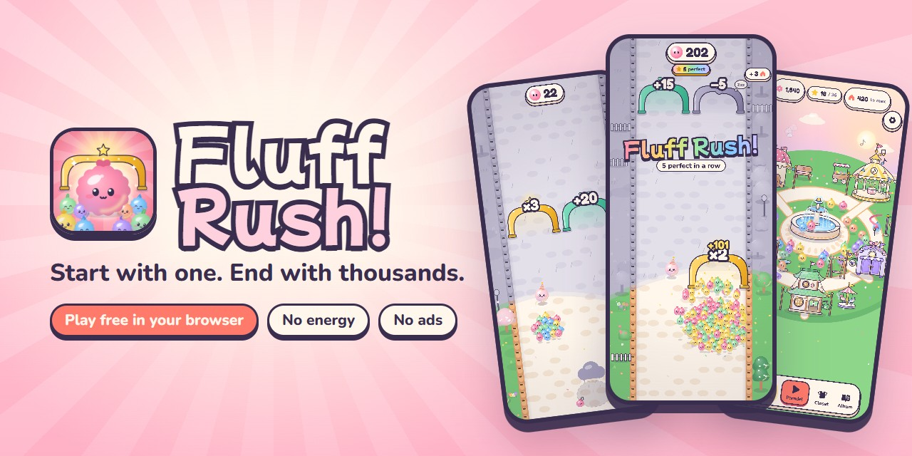
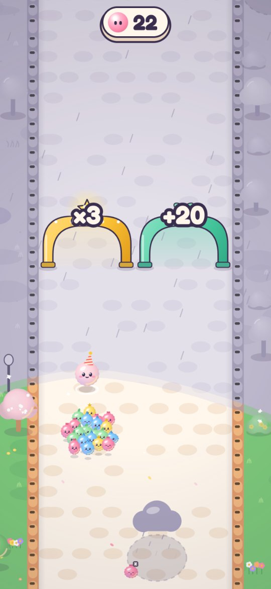
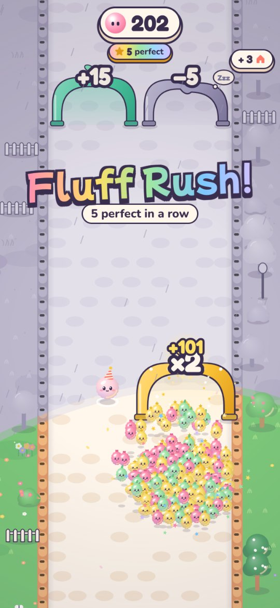
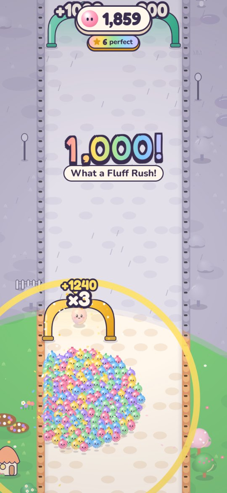
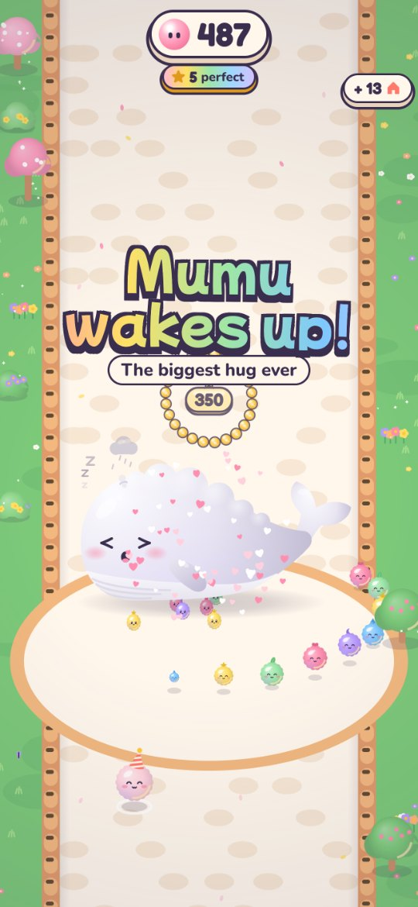
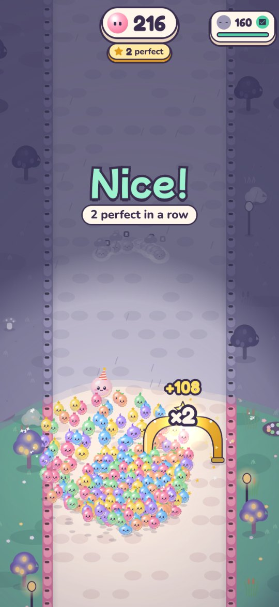
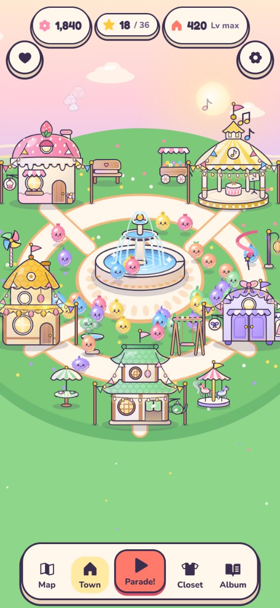

  

<h3 align="center"><a href="https://urbantorque.github.io/fluff-rush-play/">Play Fluff Rush in your browser →</a></h3>

Free · no install · no sign-up · best on a phone held upright

---

## What is Fluff Rush?

You start as **Pip**, one sleepy pom-pom in a grey, drizzly valley. Drag to steer and the parade walks on its own. Pick the right gates (`+12` or `×2`?), sweep up sleeping friends, hug the Sleepy Walls awake, and watch one Fluffling snowball into **thousands**. Wherever the parade goes, colour soaks back into the world behind it.

It's the "numbers go up" crowd fantasy you've seen in mobile ads, turned into the whole game, and made cozy: **no war, no energy timers, no forced ads, no pay-to-win.**

## How to play

| You meet | What to do |
|---|---|
| **Steer** | Drag sideways anywhere on the screen. Movement is relative, so your thumb never hides the parade. On a computer: drag, or use A/D or the arrow keys. |
| **Whistle** | Tap (don't drag) and Pip whistles: the parade huddles tight for a moment and slips past hazards. It needs a few seconds to recharge. |
| **Gates** | Only the lane your leader walks through counts. `+` adds, `×` multiplies, `−` Zzz gates send friends to nap, `÷` picnics split the parade. Close calls are on purpose: at 11, `+12` beats `×2`. |
| **Sleepy Flufflings** | Grey friends doze by the road. Sweep a wide parade over them to wake each one. |
| **Sleepy Walls** | "Needs 40": pour in and hug them awake. Half your huggers bounce back, and a few move to your town. |
| **Hazards** | Treat stalls tempt the edges, sleepy clouds drift across, lily bridges squeeze the road, and the Nap Cat sweeps its tail. |
| **The finale** | Climb the Festival Tree. The bigger the parade, the more lanterns light, and lanterns are stars. Two sleeping giants need a *really* big hug. |

## Moments to chase

- **"Fluff Rush!"** Five perfect gate picks in a row set off a rainbow callout, a slow-motion beat and a fanfare.
- **Milestones.** 100, 250, 500… **1,000!** Every new size gets its own cheer.
- **Golden Flufflings.** A rare shiny sleeper worth bonus Petals, sometimes a **Jackpot**.
- **"Phew!"** Wake a wall with only a few to spare.
- **Full bloom** and **New best!** Light all five lanterns and beat your record.
- **Sky Parade.** Finish a run and your whole parade bursts into a firework picture in the sky. Tap to pop it for bonus Petals.

## Screenshots

<table>
  <tr>
    <td align="center" width="33%"> <b>Pick your gate.</b> Colour follows the parade.</td>
    <td align="center" width="33%"> <b>Fluff Rush!</b> Five perfect picks in a row.</td>
    <td align="center" width="33%"> <b>1,000!</b> Start with one, end with thousands.</td>
  </tr>
  <tr>
    <td align="center" width="33%"> <b>Wake the giants.</b> Mumu needs a 350-strong hug.</td>
    <td align="center" width="33%"> <b>Lantern Marsh.</b> At dusk, a bigger parade sees further.</td>
    <td align="center" width="33%"> <b>Bloom Square.</b> Build a town your friends live in.</td>
  </tr>
</table>

## Between parades

- **Bloom Square.** Five buildings, three tiers each, and every one changes your runs. The Bakery gives extra starters, the Band Stand teaches tunes, the Workshop earns more Petals, the Tea House's Morning Basket fills while you're away, and the Costume Closet dresses up the whole parade.
- **Leaders.** Pip is the all-rounder. Tambo doubles `+` gates but also Zzz gates. Otto halves hazards but caps `×` at 3. Pair a leader with a tune for a little pre-run puzzle.
- **Daily Parade.** A brand-new level every day with a twist (Golden Hour, Carousel Day, Mystery Day…). Miss a day? No worries: there are no streaks to break. Share your score with one tap.
- **Star Road.** Every 3 stars opens a gift: hats, trails, decor, tunes, Petals. Gifts never expire.
- **Encores.** Three-star a level to unlock its Encore, the same road with a twist, and win a crown.
- **Album.** 12 friends to find, some only by secret play. Riddles show the way.
- **Two valleys, two bosses.** 12 levels plus a bonus parade across golden-hour Hushvale Meadow and dusky Lantern Marsh, with Mumu the cloud-whale and Luma the lantern moth.

## The Fair Play Charter

One currency, earned only by playing. No energy. No forced ads. No loot boxes. No countdown deals. Stars, cures and timers are never for sale. This playtest build has no ads and no purchases at all.

## Made differently

Every Fluffling, building and boss is **drawn in code**, and every sound is **synthesised live** in your browser. The game has no image or audio files, only a few hundred KB of TypeScript and three fonts, and it draws up to 240 bouncing Flufflings at once.

## Playtest notes

- This is a **playtest build** of a game on its way to the App Store. Your progress saves in this browser.
- To start over, add [`?fresh=1`](https://urbantorque.github.io/fluff-rush-play/?fresh=1) to the link.
- On iPhone, tap **Share → Add to Home Screen** for full-screen play with the app icon.
- Found a bug, or have thoughts? [Open an issue](https://github.com/urbantorque/fluff-rush-play/issues). What made you smile, and where you got stuck, are the most useful things to hear.

---

© 2026 urbantorque. All rights reserved. This repository only hosts the playable build (version ae00564); the game's source is private. Fonts: Mochiy Pop One, Fredoka and Nunito (SIL Open Font License). Icons: Phosphor (MIT).
